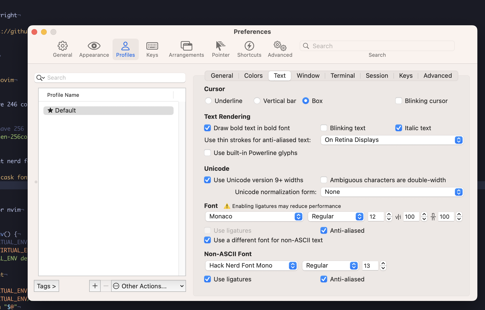
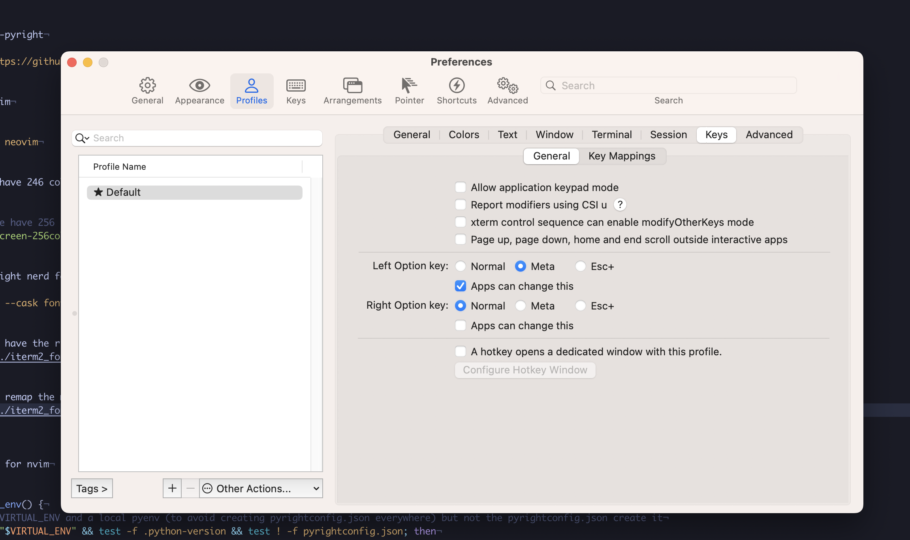

# My configuration for neovim

some import things...

install pyenv:

```bash
curl https://pyenv.run | bash
```

install pyenv-pyright
```bash
 git clone https://github.com/alefpereira/pyenv-pyright.git $(pyenv root)/plugins/pyenv-pyright
 ```

 install neovim and ripgrep

 ```bash
 brew install neovim ripgrep # Need ripgrep for telescope
 ```

make sure to have 246 colors in `.bash_profile`

```bash
# make sure we have 256 colors
export TERM=screen-256color
```

install the right python environment:
```bash
# python 3
pyenv install 3.9.7
pyenv virtualenv 3.9.7 neovim3
pyenv activate neovim3
pip install pynvim
# python 2
pyenv install 2.7.18
pyenv virtualenv 2.7.18 neovim2
pyenv activate neovim2
pip install pynvim
```

install the right nerd fonts
```bash
 brew install --cask font-hack-nerd-font
 ```

 Make sure to have the right config in iterm. See screenshot:
 


 Make sure to remap the meta key. See screenshot:
 


Alternatively install [MesloLGS NF fonts](https://github.com/romkatv/powerlevel10k#meslo-nerd-font-patched-for-powerlevel10k).
It is pretty nice with tokyonight themes.


make an alias for nvim

```bash
function nvim_env() {
 # If I have VIRTUAL_ENV and a local pyenv (to avoid creating pyrightconfig.json everywhere) but not the pyrightconfig.json create it
  if test -e "$VIRTUAL_ENV" && test -f .python-version && test ! -f pyrightconfig.json; then
    echo "VIRTUAL_ENV detected adding pyrightconfig.json"
    sleep 2
    pyenv pyright
  fi
  if [[ -e "$VIRTUAL_ENV" && -f "$VIRTUAL_ENV/bin/activate" ]]; then
    source "$VIRTUAL_ENV/bin/activate"
    command nvim "$@"
    deactivate
  else
    command nvim "$@"
  fi
}

# nvim aliases
alias vim="nvim_env"
alias nvim="nvim_env"
alias v="nvim_env"
```
